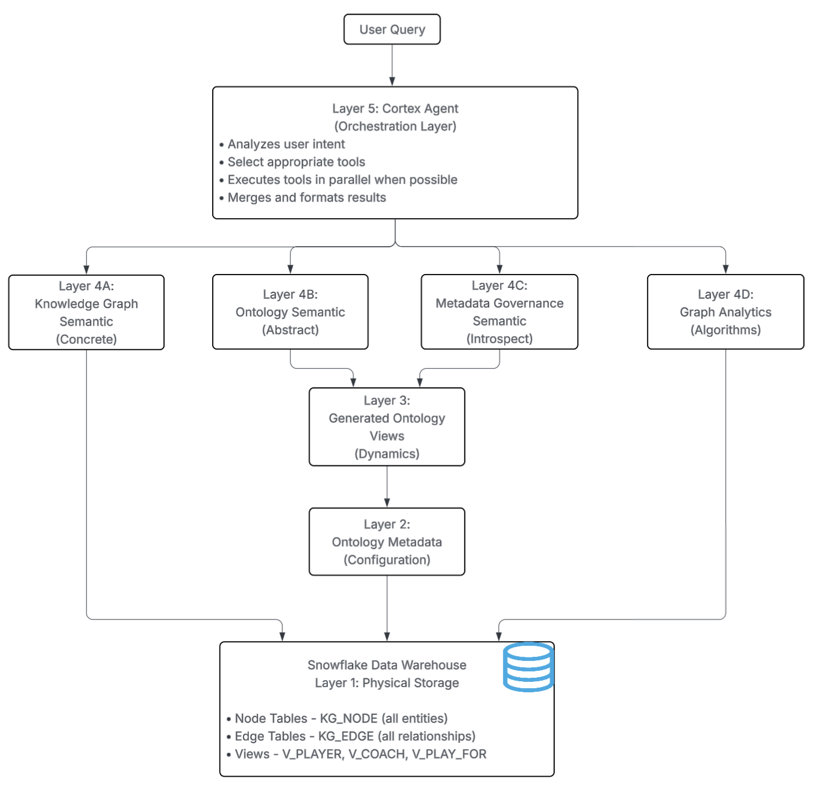

# Ontology on Snowflake

## Unifying Data, Semantics, and AI Reasoning in the Snowflake AI Data Cloud

This repository contains the complete implementation of **Ontology on Snowflake** - a Snowflake-native ontology platform that transforms Snowflake from a system that manages data into a platform that **models real-world business concepts and processes**.

## Blog Post Series

This implementation is accompanied by a three-part blog series on Medium:

1. **[Part 1: Overview and Data Model](https://medium.com/snowflake/ontology-on-snowflake-part-1-overview-and-data-model-9e8eeaac7363)** - Introduces the knowledge graph foundation and ontology metadata layer
2. **[Part 2: Semantic Models](https://medium.com/snowflake/ontology-on-snowflake-part-2-semantic-models-9aa0fa9b9312)** - Covers the three specialized Cortex Analyst semantic models
3. **[Part 3: AI-Powered Intelligence](https://medium.com/snowflake/ontology-on-snowflake-part-3-ai-powered-intelligence-bbace87c6be1)** - Details Cortex Agent orchestration and graph analytics

## Solution Overview

Ontology on Snowflake is delivered as an integrated, end-to-end capability across three parts (aligned with the blog post series):

| Part | Blog Post | Layer(s) | What's Built |
|------|-----------|----------|--------------|
| **Part 1** | *Overview and Data Model* | 1–3 | KG_NODE, KG_EDGE tables + ontology metadata + abstract views |
| **Part 2** | *Semantic Models* | 4 | Three specialized Cortex Analyst semantic models |
| **Part 3** | *AI-Powered Intelligence* | 5 | Cortex Agent + graph analytics tools |

### What Each Part Covers

1. **Part 1 – Data Model** (Layers 1-3): A flexible object–relationship foundation with ontology metadata that captures business meaning natively in Snowflake. Creates `KG_NODE` and `KG_EDGE` tables, ontology metadata tables (`ONT_CLASS`, `ONT_RELATION_DEF`, etc.), and generated abstract views (`VW_ONT_PERSON`, `VW_ONT_WORKS_FOR`).

2. **Part 2 – Semantic Models** (Layer 4): Purpose-built semantic models optimized for concrete queries (Knowledge Graph Model), abstract reasoning (Ontology Model), and governance (Metadata & Governance Model).

3. **Part 3 – AI-Powered Intelligence** (Layer 5): Intelligent agent orchestration with Cortex Agent, graph-powered reasoning via NetworkX, and natural-language interaction across all semantic models.

## Five-Layer Architecture



**Layer Summary:**
- **Layer 5** - Cortex Agent: Orchestrates semantic models and graph analytics tools
- **Layer 4** - Semantic Models: Knowledge Graph (concrete), Ontology (abstract), Metadata (introspection), Graph Analytics (algorithms)
- **Layer 3** - Generated Views: Auto-generated abstract views (VW_ONT_PERSON, VW_ONT_WORKS_FOR)
- **Layer 2** - Ontology Metadata: Classes, relationships, properties, permissions, inference rules
- **Layer 1** - Physical Storage: KG_NODE (entities) + KG_EDGE (relationships)

## Repository Structure

```
ontology_on_snowflake/
├── README.md                              # This file
├── data/                                  # Sample data files
│   ├── clubs.json                         # Soccer clubs
│   ├── persons.json                       # Players and coaches
│   ├── player_contracts.json              # Player-club contracts
│   ├── coach_contracts.json               # Coach-club contracts
│   ├── matches.json                       # Soccer matches
│   ├── match_appearances.json             # Player match appearances
│   └── metadata.json                      # Additional metadata
├── sql/                                   # SQL scripts (run in order)
│   ├── 00_setup.sql                       # Database and schema creation
│   ├── 01_physical_layer.sql              # KG_NODE and KG_EDGE tables
│   ├── 02_entity_views.sql                # V_PLAYER, V_COACH, V_CLUB, V_MATCH
│   ├── 03_relationship_views.sql          # V_PLAYS_FOR, V_COACHES, etc.
│   ├── 04_ontology_metadata.sql           # Ontology metadata tables
│   ├── 05_ontology_views_generator.sql    # SP_GENERATE_ONTOLOGY_VIEWS procedure
│   ├── 06_inference_procedures.sql        # Inference and constraint procedures
│   ├── 07_abstract_views.sql              # Pre-built abstract ontology views
│   ├── 08_seed_metadata.sql               # Seed ontology metadata
│   └── 09_load_data.sql                   # Load sample data
├── semantic_models/                       # Cortex Analyst semantic models
│   ├── soccer_semantic_model.yml          # Concrete knowledge graph model
│   ├── soccer_semantic_model_ontology.yml # Abstract ontology model
│   └── soccer_metadata_governance_model.yml # Metadata and governance model
├── agent/                                 # Cortex Agent configuration
│   └── cortex_agent_config.json           # Agent orchestration config (8 tools)
└── mcp_server/                            # SPCS graph analytics service
    ├── soccer_mcp_server.py               # Graph analytics server with 5 tools
    ├── requirements.txt                   # Python dependencies
    ├── Dockerfile                         # Container build for SPCS
    ├── service.yaml                       # SPCS service specification
    ├── deploy_spcs.sh                     # Deployment automation script
    ├── deploy_to_spcs.sql                 # Snowflake infrastructure setup
    ├── spcs_service_functions.sql         # Service functions for Cortex Agent
    ├── SPCS_DEPLOYMENT_GUIDE.md           # Complete deployment guide
    ├── README.md                          # MCP server documentation
    └── graph_data/                        # Static JSON data for graph analytics
        ├── persons.json                   # 41 players + 11 coaches
        ├── clubs.json                     # 15 soccer clubs
        ├── matches.json                   # 20 matches
        ├── player_contracts.json          # Player contract history
        ├── coach_contracts.json           # Coach contract history
        ├── match_appearances.json         # Player match statistics
        └── metadata.json                  # Data summary
```

## Quick Start

### Prerequisites
- Snowflake account with ACCOUNTADMIN role (or equivalent permissions)
- Access to Cortex Analyst and Cortex Agent (preview features)
- Docker (optional, for SPCS graph analytics deployment)

### Step 1: Create Database and Schema (Part 1 - Layers 1-2)

Open a Snowflake worksheet and run the SQL scripts in order. These scripts create the database `ONTOLOGY_DB` with schema `SOCCER_KG`:

```sql
-- Connect to Snowflake
USE ROLE ACCOUNTADMIN;

-- 1. Create database and schema
-- Run: sql/00_setup.sql
CREATE OR REPLACE DATABASE ONTOLOGY_DB;
USE DATABASE ONTOLOGY_DB;
CREATE OR REPLACE SCHEMA SOCCER_KG;
USE SCHEMA SOCCER_KG;

-- 2. Create physical layer (Layer 1: KG_NODE and KG_EDGE tables)
-- Run: sql/01_physical_layer.sql

-- 3. Create entity convenience views
-- Run: sql/02_entity_views.sql

-- 4. Create relationship convenience views  
-- Run: sql/03_relationship_views.sql

-- 5. Create ontology metadata tables (Layer 2)
-- Run: sql/04_ontology_metadata.sql

-- 6. Create ontology view generator procedure
-- Run: sql/05_ontology_views_generator.sql

-- 7. Create inference and constraint procedures
-- Run: sql/06_inference_procedures.sql

-- 8. Create abstract ontology views (Layer 3)
-- Run: sql/07_abstract_views.sql

-- 9. Seed ontology metadata
-- Run: sql/08_seed_metadata.sql
```

### Step 2: Load Sample Data

Upload data files to a Snowflake stage and load them:

```sql
USE DATABASE ONTOLOGY_DB;
USE SCHEMA SOCCER_KG;

-- The stage is created by 09_load_data.sql
-- Upload data files from the data/ folder to the stage
PUT file:///path/to/ontology_on_snowflake/data/clubs.json @SOCCER_DATA_STAGE;
PUT file:///path/to/ontology_on_snowflake/data/persons.json @SOCCER_DATA_STAGE;
PUT file:///path/to/ontology_on_snowflake/data/player_contracts.json @SOCCER_DATA_STAGE;
PUT file:///path/to/ontology_on_snowflake/data/coach_contracts.json @SOCCER_DATA_STAGE;
PUT file:///path/to/ontology_on_snowflake/data/matches.json @SOCCER_DATA_STAGE;
PUT file:///path/to/ontology_on_snowflake/data/match_appearances.json @SOCCER_DATA_STAGE;

-- Run: sql/09_load_data.sql (loads data from stage into KG_NODE and KG_EDGE)
```

### Step 3: Generate Ontology Views (Layer 3)

Generate abstract views from the ontology metadata:

```sql
CALL SP_GENERATE_ONTOLOGY_VIEWS();
```

### Step 4: Run Inference Engine

Execute ontology inference to generate derived relationships (e.g., inverse relationships):

```sql
CALL SP_RUN_ONTOLOGY_INFERENCE();
```

### Step 5: Deploy Semantic Models (Part 2 - Layer 4)

Create a stage for semantic models and upload the YAML files:

```sql
-- Create stage for semantic models
CREATE OR REPLACE STAGE SEMANTIC_MODELS
    DIRECTORY = (ENABLE = TRUE);

-- Upload semantic model files
PUT file:///path/to/ontology_on_snowflake/semantic_models/soccer_semantic_model.yml @SEMANTIC_MODELS;
PUT file:///path/to/ontology_on_snowflake/semantic_models/soccer_semantic_model_ontology.yml @SEMANTIC_MODELS;
PUT file:///path/to/ontology_on_snowflake/semantic_models/soccer_metadata_governance_model.yml @SEMANTIC_MODELS;

-- Verify upload
LIST @SEMANTIC_MODELS;
```

### Step 6: Configure Cortex Agent (Part 3 - Layer 5)

The Cortex Agent configuration is in `agent/cortex_agent_config.json`. To deploy:

1. **Create Agent** in Snowflake (via UI or SQL)
2. **Reference Semantic Models** at `@ONTOLOGY_DB.SOCCER_KG.SEMANTIC_MODELS/`
3. **Configure Graph UDFs** (optional - see below)

### Step 7: Deploy Graph Analytics (Optional)

Deploy graph analytics tools to Snowflake Container Services (SPCS):

```bash
cd mcp_server
./deploy_spcs.sh
```

See `mcp_server/SPCS_DEPLOYMENT_GUIDE.md` for detailed deployment instructions including:
- Building and pushing the Docker image
- Creating the SPCS compute pool
- Deploying the service
- Creating service functions for Cortex Agent integration

### Verify Installation

After completing the steps above, run these verification queries:

```sql
-- Verify data loaded correctly
SELECT NODE_TYPE, COUNT(*) FROM KG_NODE GROUP BY NODE_TYPE;
-- Expected: CLUB (15), COACH (11), MATCH (20), PLAYER (41)

SELECT EDGE_TYPE, COUNT(*) FROM KG_EDGE GROUP BY EDGE_TYPE;
-- Expected: COACHES, HOME_TEAM, AWAY_TEAM, PLAYED_IN, PLAYS_FOR

-- Verify ontology metadata
SELECT CLASS_NAME, IS_ABSTRACT FROM ONT_CLASS WHERE STATUS = 'ACTIVE';
-- Expected: Thing, Person, Organization, Event (abstract) + Player, Coach, Club, Match (concrete)

-- Test a concrete query (Part 1/2)
SELECT p.NAME, pf.JERSEY_NUMBER FROM V_PLAYER p
JOIN V_PLAYS_FOR pf ON p.NODE_ID = pf.PLAYER_ID
JOIN V_CLUB c ON pf.CLUB_ID = c.NODE_ID
WHERE c.NAME = 'Real Madrid' LIMIT 5;

-- Test an abstract query (Part 2)
SELECT SUBTYPE, COUNT(*) FROM VW_ONT_PERSON GROUP BY SUBTYPE;
-- Expected: Player (41), Coach (11)
```

## Three Semantic Models

### 1. Knowledge Graph Model (`soccer_semantic_model.yml`)
- **Purpose**: High-performance queries on concrete entity types
- **Use for**: "Who plays for Real Madrid?", "Show match results"
- **Tables**: V_PLAYER, V_COACH, V_CLUB, V_MATCH, V_PLAYS_FOR, V_COACHES, V_PLAYED_IN, V_HOME_TEAM, V_AWAY_TEAM

### 2. Ontology Model (`soccer_semantic_model_ontology.yml`)
- **Purpose**: Abstract, cross-type reasoning
- **Use for**: "Who are all people at Real Madrid?", "Show all personnel"
- **Tables**: VW_ONT_PERSON, VW_ONT_ORGANIZATION, VW_ONT_EVENT, VW_ONT_WORKS_FOR, VW_ONT_PARTICIPATES_IN, REL_RESOLVED

### 3. Metadata & Governance Model (`soccer_metadata_governance_model.yml`)
- **Purpose**: Introspection of ontology structure and capabilities
- **Use for**: "What object types exist?", "What can ANALYST role do?"
- **Tables**: ONT_CLASS, ONT_RELATION_DEF, ONT_PROPERTY, ONT_PERMISSION, ONT_ROLE, ONT_RULE

## Graph Analytics

Graph analytics are provided via **Snowflake Container Services (SPCS)** running a NetworkX-powered service with 5 tools:

| Tool | Description | Algorithm |
|------|-------------|-----------|
| `graph_shortest_path` | Find connection paths between entities | Dijkstra's algorithm |
| `graph_centrality_analysis` | Entity importance metrics | Betweenness, closeness, degree, eigenvector |
| `graph_community_detection` | Group identification | Louvain algorithm |
| `graph_transfer_network_analysis` | Player transfer patterns | Custom transfer analysis |
| `graph_temporal_analysis` | Network evolution over time | Time-series network metrics |

**Deployment:** Deploy to SPCS using `mcp_server/deploy_spcs.sh` - see `SPCS_DEPLOYMENT_GUIDE.md` for details.

## Key Features

- **Universal Node-Edge Model**: Flexible VARIANT properties support any entity type
- **Metadata-Driven Configuration**: Business meaning defined as metadata, not code
- **Auto-Generated Views**: Ontology views generated from metadata via `SP_GENERATE_ONTOLOGY_VIEWS()`
- **Polymorphic Queries**: Query abstract concepts (Person) spanning concrete types (Player, Coach)
- **Inference Engine**: Transitive closure, inverse relationships, property chains
- **Data Quality**: Constraint checking and violation tracking
- **Access Control**: Role-based permissions mapped to Snowflake roles
- **Graph Analytics**: NetworkX-powered analysis via SPCS
- **8-Tool Agent**: Cortex Agent with 3 semantic query tools + 5 graph analytics tools
- **Native Deployment**: Graph analytics run as Snowflake Container Service

## Sample Queries

### Concrete Query (Knowledge Graph Model)
```sql
-- Who plays for Real Madrid?
SELECT p.NAME, p.POSITION, pf.JERSEY_NUMBER, c.NAME AS club
FROM V_PLAYER p
JOIN V_PLAYS_FOR pf ON p.NODE_ID = pf.PLAYER_ID
JOIN V_CLUB c ON pf.CLUB_ID = c.NODE_ID
WHERE c.NAME = 'Real Madrid'
  AND (pf.EFFECTIVE_END IS NULL OR pf.EFFECTIVE_END >= CURRENT_DATE());
```

### Abstract Query (Ontology Model)
```sql
-- Who works for Real Madrid? (includes players AND coaches)
SELECT 
  p.SUBTYPE as role,
  CASE 
    WHEN p.SUBTYPE = 'Player' THEN vp.NAME
    WHEN p.SUBTYPE = 'Coach' THEN vc.NAME
  END as person_name
FROM VW_ONT_PERSON p
JOIN VW_ONT_WORKS_FOR wf ON p.ID = wf.SUBJECT_ID
LEFT JOIN V_PLAYER vp ON p.ID = vp.NODE_ID AND p.SUBTYPE = 'Player'
LEFT JOIN V_COACH vc ON p.ID = vc.NODE_ID AND p.SUBTYPE = 'Coach'
JOIN V_CLUB c ON wf.OBJECT_ID = c.NODE_ID
WHERE c.NAME = 'Real Madrid';
```

### Metadata Query (Governance Model)
```sql
-- What object types exist in the ontology?
SELECT CLASS_NAME, IS_ABSTRACT, DESCRIPTION, PARENT_CLASS_NAME
FROM ONT_CLASS
WHERE ONTOLOGY_NAME = 'SOCCER_V1'
  AND STATUS = 'ACTIVE'
ORDER BY PARENT_CLASS_NAME NULLS FIRST, CLASS_NAME;
```

## Agent Orchestration (Part 3 - Layer 5)

The Cortex Agent uses the configuration in `agent/cortex_agent_config.json` and provides **8 specialized tools** organized in 3 categories:

### Semantic Query Tools (Cortex Analyst)
| Tool | Purpose | Semantic Model |
|------|---------|----------------|
| `query_soccer_data` | Concrete entities and statistics | `soccer_semantic_model.yml` |
| `query_soccer_ontology` | Abstract relationship patterns | `soccer_semantic_model_ontology.yml` |
| `query_metadata_governance` | Data model introspection | `soccer_metadata_governance_model.yml` |

### Graph Analytics Tools (SPCS)
| Tool | Purpose |
|------|---------|
| `centrality_tool` | Betweenness, closeness, degree, eigenvector |
| `community_detection_tool` | Louvain community detection |
| `shortest_path_tool` | Find connection paths between entities |
| `temporal_analysis_tool` | Network evolution over time |
| `transfer_analysis_tool` | Player transfer patterns |

### Intent-Driven Routing

The agent analyzes user intent and routes to the appropriate tool:

| User Query | Tool Selected | Reason |
|------------|---------------|--------|
| "Who plays for Real Madrid?" | `query_soccer_data` | Specific entity query |
| "Who works for Real Madrid?" | `query_soccer_ontology` | Abstract cross-type query |
| "What object types exist?" | `query_metadata_governance` | Schema introspection |
| "How is Messi connected to Ronaldo?" | `shortest_path_tool` | Network path finding |
| "Who are the most influential players?" | `centrality_tool` | Centrality analysis |
| "What communities exist?" | `community_detection_tool` | Community detection |
| "How has the transfer network evolved?" | `temporal_analysis_tool` | Time-based analysis |
| "Which clubs trade most frequently?" | `transfer_analysis_tool` | Transfer patterns |

## License

MIT License

Copyright © 2026 - All rights reserved
